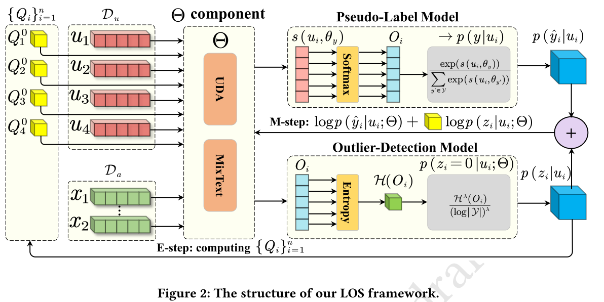
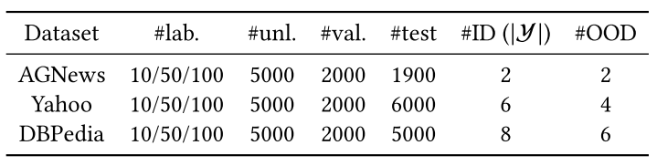
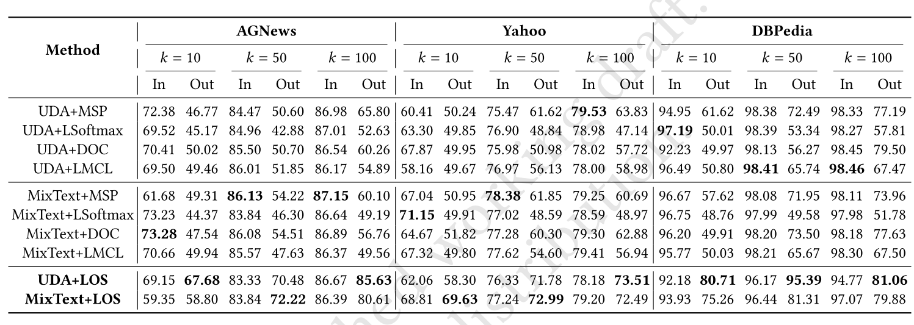

# SIGKDD2023_Latent_Outlier_Softening
Code and dataset for our paper "Open-Set Semi-Supervised Text Classification with Latent Outlier Softening", SIGKDD2023

The code is implemented using Pytorch.

## Overview

In this project, we focus on the open-set semi-supervised text classification(OSTC) task in text classification.

As open-set semi-supervised learning has not been studied in text classification, we follow the pipeline approach in open-set semi-supervised image classification to combine the semi-supervised learning model with outlier detectors. Specifically, we train a pipeline OSTC model in two steps: (1) first, train existing outlier detectors in text classification on the labeled-text set D𝑎 and leverage them to filter out OOD examples in the unlabeled-text set D𝑢 ; (2) then, use the remaining unlabeled-text set to train the STC model. This approach reduces the negative impact of the OOD texts by excluding OOD examples by hard filtering. For outlier detection, we introduce the recent outlier detector used in text classification, including MSP [1], DOC [2], LMCL [3] and Softmax [4]. Meanwhile, we select the recent UDA [5] and MixText [6] as the STC models in the pipeline approach, which leverage BERT and consistency training with data augmentation techniques. We name these pipeline models combining the outlier detectors and STC models with a “+” symbol, e.g., UDA+MSP, UDA+DOC, etc.

Although the pipeline approach for OSTC is simple and has shown to be effective, its hard OOD filtering strategy may cause error recognition of ID or OOD texts that harm the OSTC training. To tackle this problem, we propose a Latent Outlier Softening (LOS) framework shown in following Figure to replace hard OOD filtering with OOD softening that adaptively assigns soft weights to objectives of text examples, where the lower weights are resorted to weaken the negative impact of OOD texts. LOS is naturally derived from latent variable modeling. The details of assumptions and derivation may be difficult to describe here clearly, so if you want to learn more about the model, try to read the paper.



## Datasets

We create three benchmarks from existing text classification datasets to evaluate OSTC: AGNews, DBPedia and Yahoo. The statistics of the datasets is below. # lab, #unl., #val and #test respectively denote the labelled, unlabeled, validation and test texts for each class. And #ID (|Y|), #OOD denote the number of ID classes and OOD classes, respectively.



We provide the processed data as well as the raw data for these three datasets. The datasets can be downloaded from the [Baidu Cloud](https://pan.baidu.com/s/14m3urzM4PyNhWdK8fnYB5Q), access code is a53b.

. You just need to download datasets and then put them in the corresponding directories. You can also try to use back translation to augment the data to get better performance.

## Training and Evaluation

The scripts directory contains all the .sh files, including training and testing the model, as well as all the ablation experiments.

First install the required environment according to requirements.txt.

```
pip install -i requirements.txt
```

Note that some additional environments may need to be installed, just install them according to the error message.

The statements to run the python program have been written in the .sh file, and the corresponding parameters have been set, so you can refer to them and set your own parameters.

The file name that contains UDA is the code that is improved based on UDA, the one that does not contain UDA is the code that is improved based on MixText, the one that contains EM is the method implemented in the paper, the one that contains case study is the case study code, and the one with only the word cls is the implementation of the baseline code. If you want to modify the read data file, just modify the data path in read_data.py or read_data_cls.py.

The main results are shown below.



## Reference

[1] Dan Hendrycks and Kevin Gimpel. 2017. A Baseline for Detecting Misclassified and Out-of-Distribution Examples in Neural Networks. In ICLR

[2] Lei Shu, Hu Xu, and Bing Liu. 2017. DOC: Deep Open Classification of Text Documents. In EMNLP. 2911–2916.

[3] Ting-En Lin and Hua Xu. 2019. Deep Unknown Intent Detection with Margin Loss. In ACL. 5491–5496.

[4] Guangfeng Yan, Lu Fan, Qimai Li, Han Liu, Xiaotong Zhang, Xiao-Ming Wu, and Albert Y.S.Lam. 2020. Unknown Intent Detection Using Gaussian Mixture Model with an Application to Zero-shot Intent Classification. In ACL. 1050-1060

[5] Qizhe Xie, Zihang Dai, Eduard H. Hovy, Thang Luong, and Quoc Le. 2020. Unsupervised Data Augmentation for Consistency Training. In NeurIPS.

[6] Jiaao Chen, Zichao Yang, and Diyi Yang. 2020. MixText: Linguistically-Informed Interpolation of Hidden Space for Semi-Supervised Text Classification. In ACL. 2147–2157.
